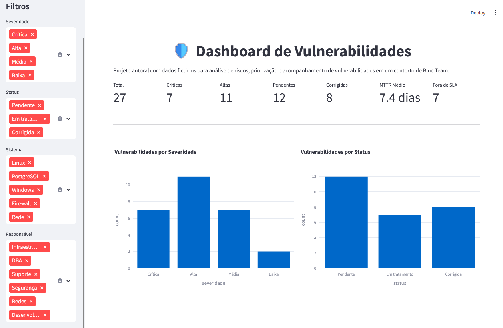
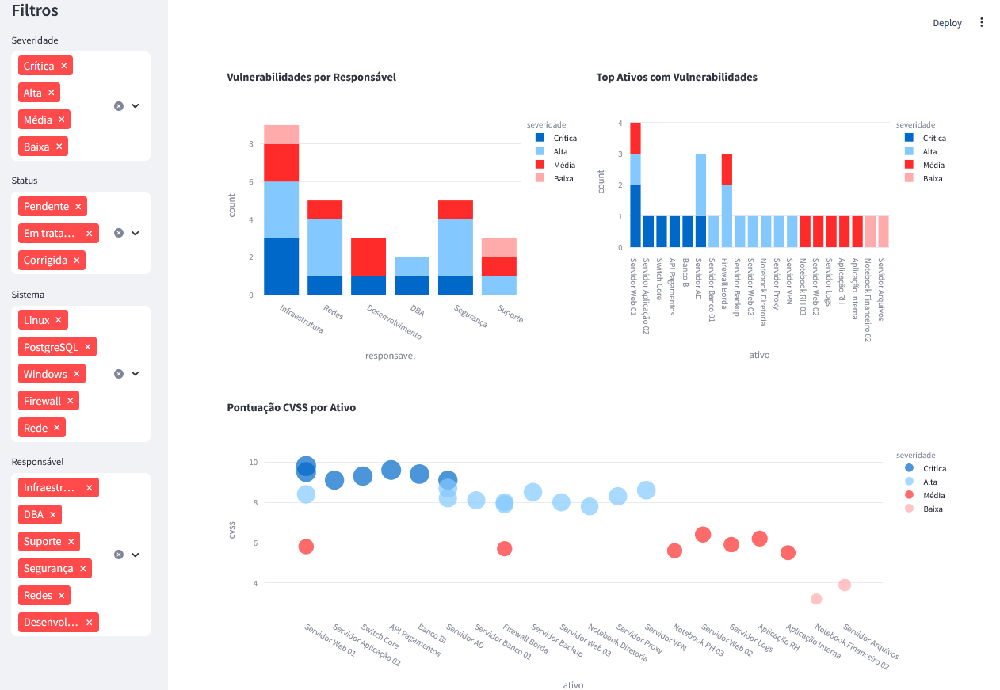
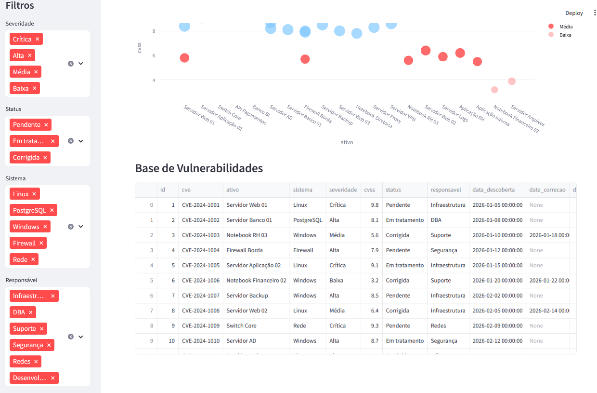

# Dashboard de Vulnerabilidades





## Sobre o Projeto

Dashboard desenvolvido para monitoramento e análise de vulnerabilidades em ambientes corporativos, com foco em Segurança da Informação, Blue Team e Gestão de Vulnerabilidades.

O projeto utiliza dados fictícios para demonstrar a construção de indicadores de segurança, análise de riscos e acompanhamento de vulnerabilidades de forma visual e interativa.

## Objetivos

* Consolidar vulnerabilidades identificadas em diferentes ativos.
* Facilitar a priorização de riscos utilizando severidade e CVSS.
* Apoiar a tomada de decisão em processos de Gestão de Vulnerabilidades.
* Demonstrar competências em Python, Streamlit, Análise de Dados e Segurança da Informação.

## Tecnologias Utilizadas

* Python
* Streamlit
* Pandas
* Plotly
* Git
* GitHub

## Funcionalidades

* Visualização de vulnerabilidades por severidade.
* Visualização de vulnerabilidades por status.
* Indicadores executivos.
* Tabela interativa de vulnerabilidades.
* Dashboard responsivo.

## Estrutura do Projeto

```text
dashboard-vulnerabilidades/
│
├── app.py
├── README.md
├── requirements.txt
├── data/
│   └── vulnerabilidades.csv
└── images/
```

## Conceitos Aplicados

* Gestão de Vulnerabilidades
* Blue Team
* Análise de Riscos
* CVSS
* Segurança da Informação
* Monitoramento de Segurança

## Próximas Evoluções

* Filtros por severidade.
* Filtros por sistema operacional.
* Indicadores MTTD e MTTR.
* Dashboard executivo avançado.
* Publicação no Streamlit Cloud.

## Autora

Alê Tavares 

LinkedIn:
https://www.linkedin.com/in/aletavaress

Portfólio:
https://alexsabrasil.github.io/byaletavares.com/
